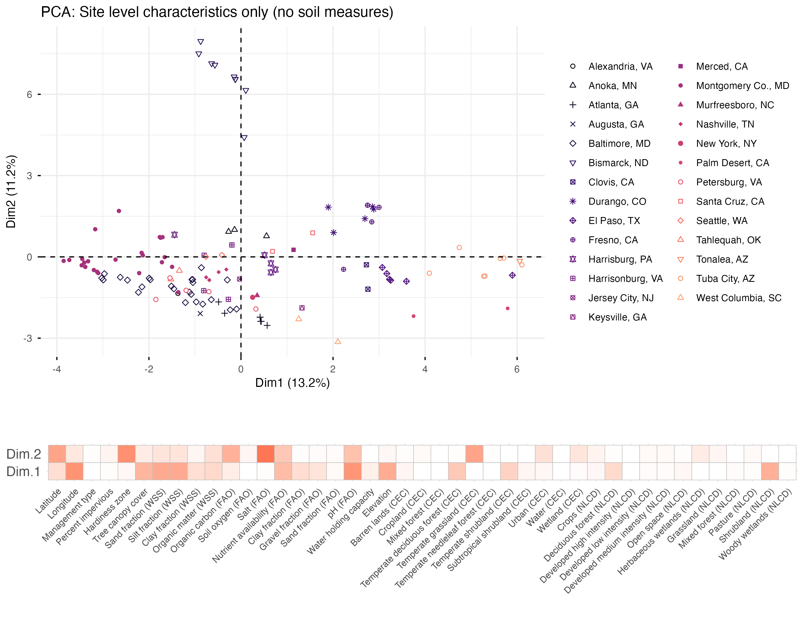
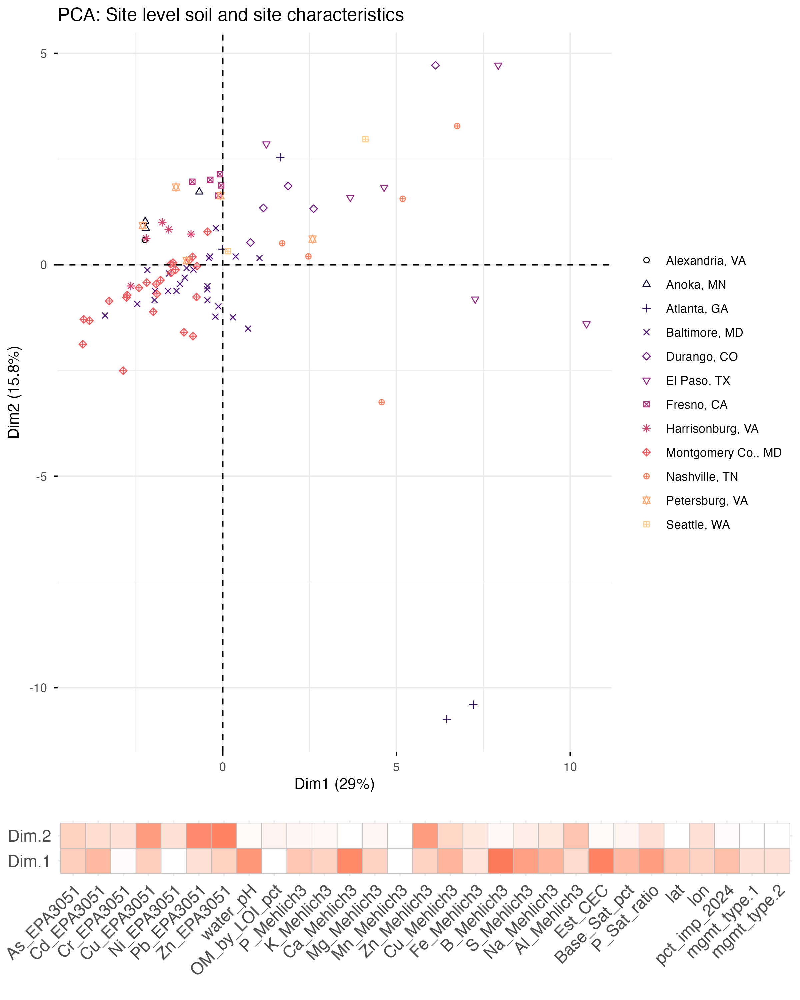
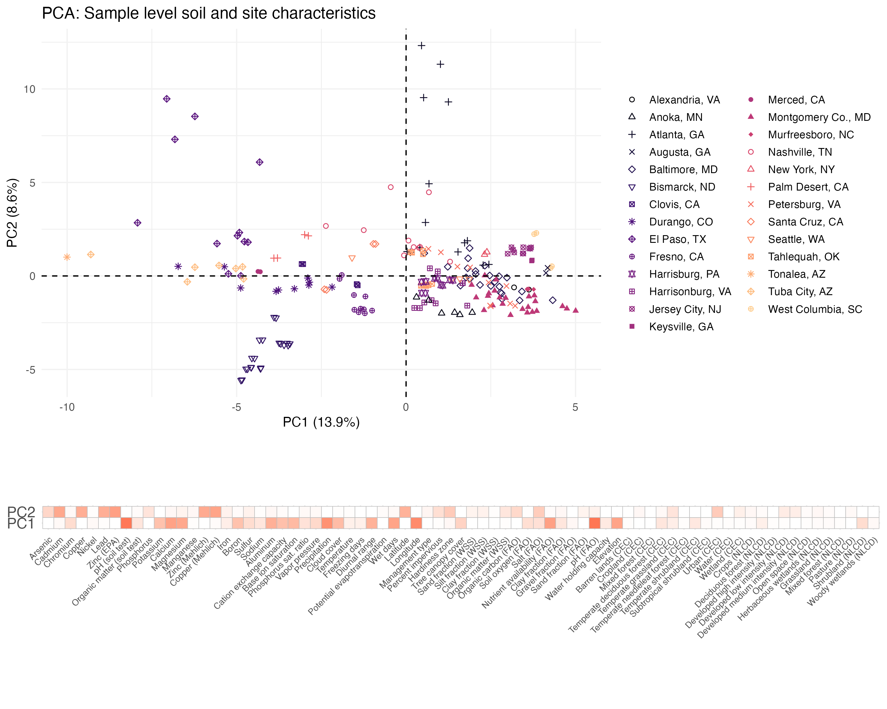

# BioDIGS Site and Soil Sample PCAs

The goal with these PCAs is to understand the difference among sampling locations and soil samples. This helps us understand the diversity of microbiome environments.

**Site-level variation**

The following takes into account site-level data, primarily geospatial information.Each point represents a site.

The following takes into account site-level and sample-level data, including geospatial information and soil testing information. Samples are averaged within a single sampling site (e.g., BO1). Each point represents a site.

**Sample-level variation**

The following takes into account site-level and sample-level data, including geospatial information and soil testing information. Each point represents a sample (e.g., B01_1).

